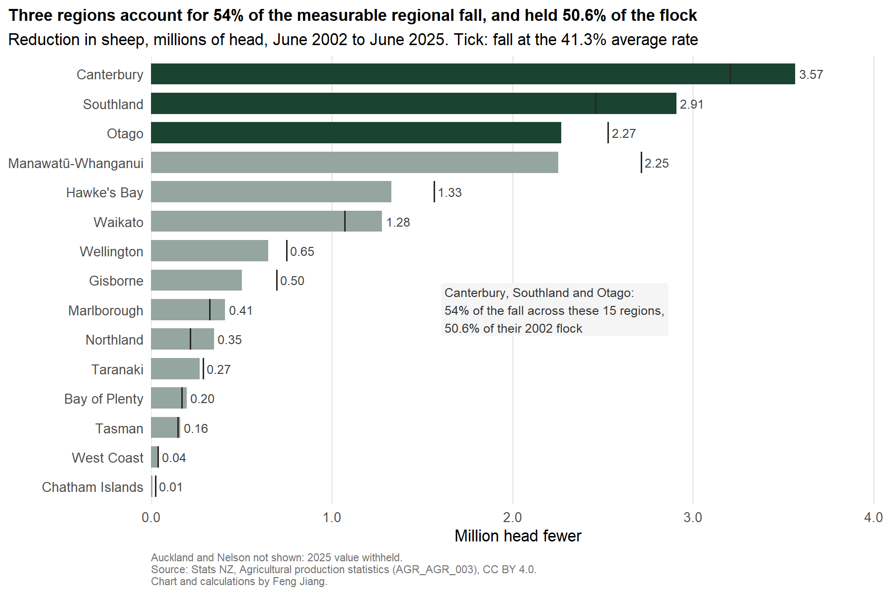
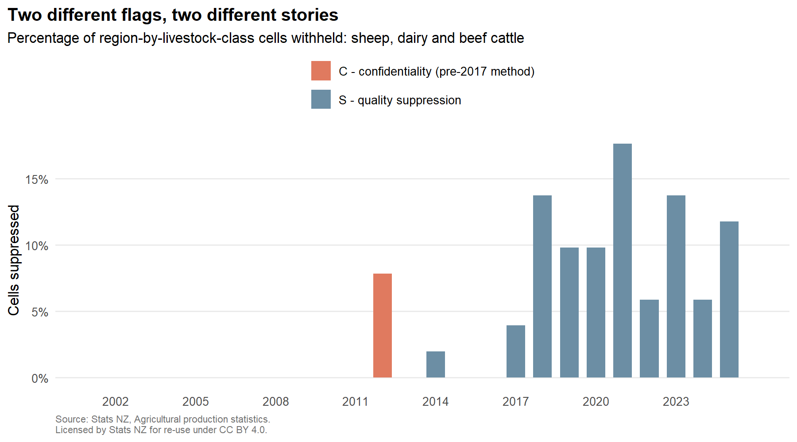

# Where New Zealand's sheep went: a regional breakdown of the flock decline, 2002–2025

New Zealand's sheep flock fell by 16.32 million head between June 2002 and June 2025, and three regions account for over half of that fall.

**[Read the full release →](https://kenchch.github.io/nz-sheep-decline-by-region/)**



## Key findings

- Canterbury, Southland and Otago together account for **54 percent** of the national fall, measured across the 15 regions where both endpoints are published.
- Over the same 23 years the national dairy herd grew by only **588 thousand** cattle against a fall of 16.3 million sheep — two different orders of magnitude, which is the arithmetic the "sheep became dairy" story has to survive.
- In **7 of the 13** regions where both series are published, dairy cattle fell *alongside* sheep rather than in place of them. Canterbury is the one region where substitution carries real weight, at 22 dairy cattle gained per 100 sheep lost.

## Data quality checks

Five validation rules run over the analysis table on every render; all pass.

| Rule | Items | Passes | Fails |
|---|---:|---:|---:|
| `head_non_negative` | 1,397 | 1,397 | 0 |
| `value_iff_suppressed` | 1,397 | 1,397 | 0 |
| `region_label_present` | 1,397 | 1,397 | 0 |
| `no_duplicate_cells` | 1,397 | 1,397 | 0 |
| `year_in_series_window` | 1,397 | 1,397 | 0 |

The more interesting result is the reconciliation. Summing the regions and comparing against the published national total gives a residual of **exactly zero head** in every year where all seventeen regions are published and no cell is suppressed. The residual becomes non-zero for two reasons only: a suppressed region, or a region code absent from that year's table. It peaks at 2.17 percent in 2021.

Suppression is also not one thing. The `OBS_STATUS` column carries two different flags, and separating them turns an apparent anomaly into confirmation of the published method:

- **`C`, confidentiality.** Appears in 2012–2016 across the whole extract and **never after 2016**. Stats NZ states that `C` was used prior to 2017 and that confidentiality has since been implemented by input perturbation instead, so cells no longer need replacing with `C`. The file stops using the flag in the same year the method changed.
- **`S`, quality suppression** — applied where sampling errors or imputation levels are high. Runs from 2014 to 2025 and peaks at 17.6 percent of cells in 2021, with census years sitting below the survey years around them, as a rule keyed to sampling error would predict.

The 2012 spike is therefore not a quality problem at all: all four withheld cells that year are `C`, not `S`. Whether the absence of any flag before 2012 means "nothing withheld" or "flag not carried in this export" cannot be determined from the extract, and the report says so.

Two suppressed regions are explained in the methodology rather than guessed at: sampling error could not be calculated for Nelson because only one responding unit was observed per sampled stratum.



## Data source and licence

Stats NZ table `AGR_AGR_003`, *Livestock Numbers by Regional Council*, dataflow `STATSNZ:AGR_AGR_003(1.0)`, final vintage, downloaded 2026-09-04 and committed with its SHA-256. Full provenance in [`data-raw/SOURCE.md`](data-raw/SOURCE.md).

> Source data: Stats NZ, Agricultural production statistics, licensed by Stats NZ for re-use under the Creative Commons Attribution 4.0 International licence.

Code in this repository is MIT licensed. See [`LICENSE`](LICENSE).

Every methodological statement in the report was read on its source page before being written down; the [report lists which page each one came from](https://kenchch.github.io/nz-sheep-decline-by-region/#sources-for-the-methodological-statements). Claims that could not be sourced there are not made.

## Method

1. **One table, one vintage** — downloaded once, committed with its hash. A pipeline that re-queries the API on every run would silently change its own answers at the next release.
2. **Codes verified before code was written** — the extract carries numeric codes and no labels. The three livestock codes used were each confirmed against published June 2024 national figures. The codelist holds 44 nested entries; adding all 44 gives 115.7 million animals against a published 33.8 million.
3. **Aggregates separated, not summed** — `AREA` 10, 19 and 20 are island and national totals. They are flagged and excluded from every regional sum.
4. **Suppressed cells stay suppressed** — `NA` plus a flag, never zero, never dropped. Two regions are excluded from the change calculation for missing an endpoint, and are counted in the text.
5. **Reconciliation reported, not asserted** — no fixed tolerance. The residual is computed for every year and published.

## Limitations

- Non-census years are sample estimates. Sampling errors are not recomputed and no weighting is applied here; a movement in a single small region should not be read as real change.
- Imputation is large: Stats NZ reports 30 percent of the 2025 total sheep estimate as imputed, against a 3 percent relative sampling error. Every survey-year regional figure carries that.
- All comparisons are ratios of head counts. They say nothing about stocking rate, feed demand, land use or emissions.
- The target population is GST-registered agricultural businesses, so coverage of the smallest farms is partial and not quantifiable from published data.
- The 2002–2025 endpoints are a choice. A 2015–2025 window gives the same qualitative answer, with the same three regions accounting for 59 percent rather than 54 percent.
- No map is drawn, deliberately: a choropleth encodes land area rather than magnitude, and the three largest contributors are also among the largest regions by area.

## Reproduce

```bash
git clone https://github.com/Kenchch/nz-sheep-decline-by-region.git
cd nz-sheep-decline-by-region
quarto render
```

```
index.qmd                 the published report
R/load.R                  read, label, isolate suppressed cells
R/checks.R                five validation rules and the reconciliation
data-raw/                 the pinned extract and its provenance
outputs/                  analysis table, validation summary, figures
```
